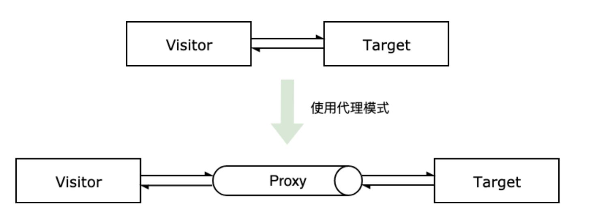
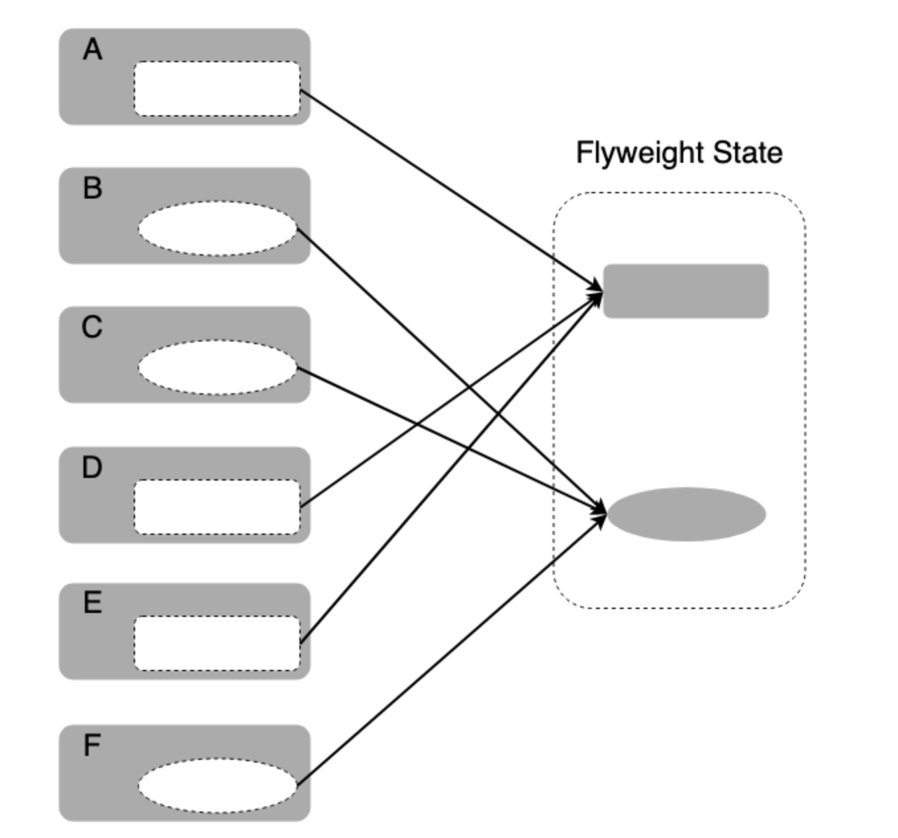
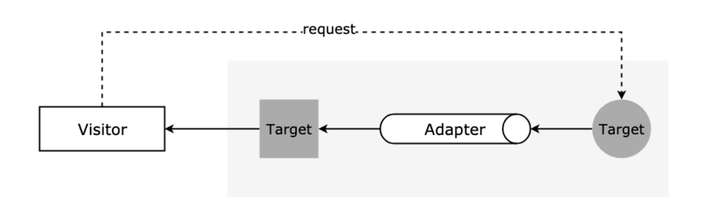
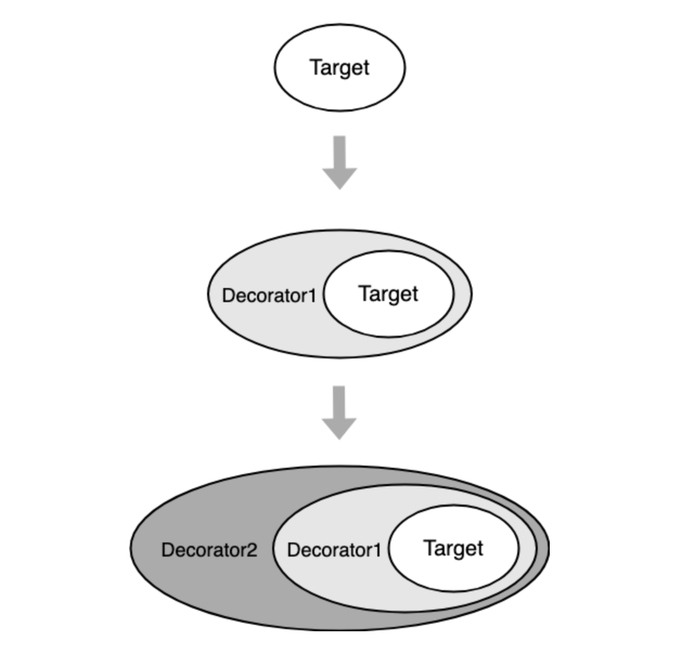
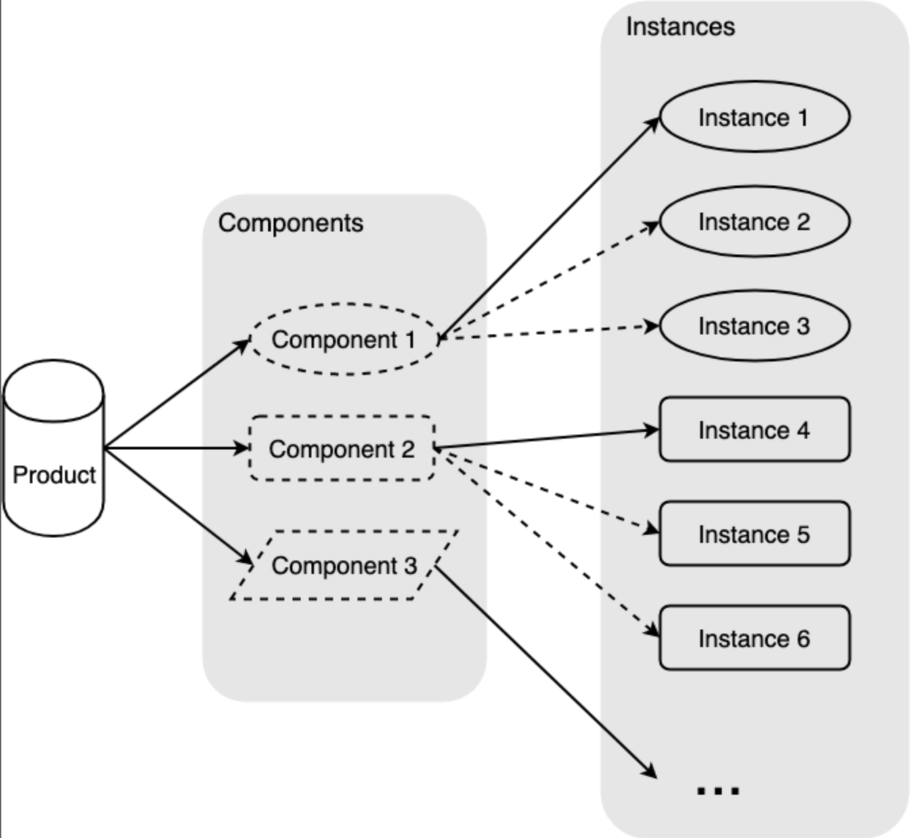
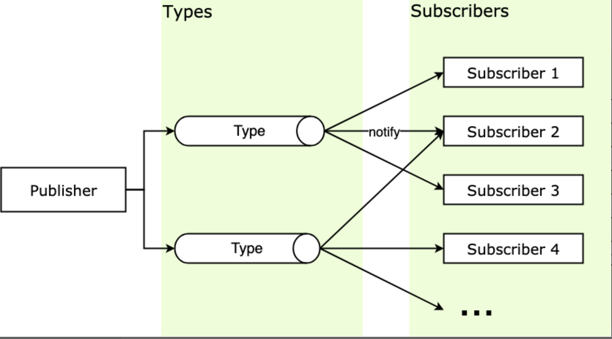
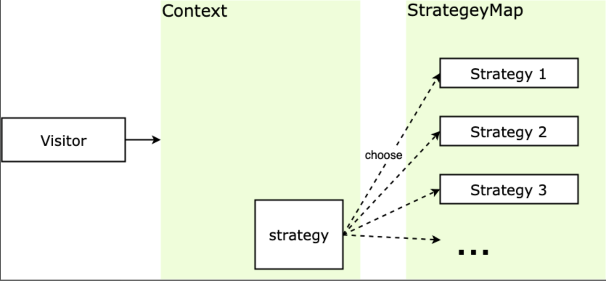
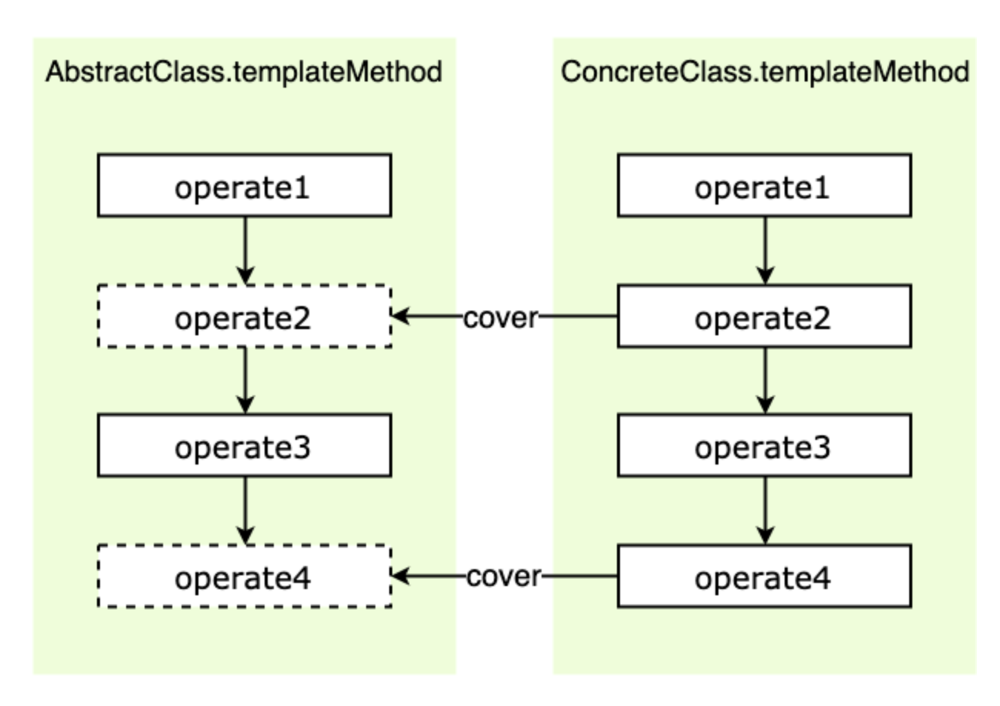

## 设计模式

### 先序

- [柯里化](https://github.com/hongguang-alt/design-patterns/blob/master/perface/curry.js)
  - 参数复用
  - 提前计算
  - 延迟计算/运行
- [反柯里化](https://github.com/hongguang-alt/design-patterns/blob/master/perface/anti-curry.js)
- [偏函数](https://github.com/hongguang-alt/design-patterns/blob/master/perface/partial.js)

柯里化和反柯里化的区别：

1.柯里化是在运算前提前传参，可以传递多个参数。

2.反柯里化是延迟传参，在运算时就把已经固定的参数或者 this 上下文等作为参数延迟到未来传递。

偏函数和柯里化的区别：

1.柯里化是一个接受 n 个参数的函数，由原本的一次性传递所有参数并执行成为了可多次接受参数再执行

```javascript
    add = (x,y,x) => x + y + z -> currAdd = x=>y=>z=>x+y+z
```

2.偏函数固定了函数的某个部分，通过传入的参数或者额方法返回一个新的函数来接受剩余的参数，数量可能是一个也可能是多个。

当一个柯里化函数只接受两次参数时，比如 curry()()，这时候的柯里化函数和偏函数概念类似，可以认为偏函数是柯里化函数的退化版

<hr style="height:1px" />

### 设计原则

JS 是一种基于原型链实现的模式。
这里着重将三大特性中的**继承**，以及六大原则中的**单一职责原则**，**开放封闭原则**，**最少知识原则**。

> 设计原则是指导思想，从思想上给我们指明程序设计的正确方向，是我们在开发设计过程中应该尽力遵守的准则。而设计模式是实现手段，因此设计模式也应该遵守这些原则，或者说，设计模式就是这些设计原则的一些具体体现。要达到的目标就是高内聚低耦合，高内聚是说模块内部要高度聚合，是模块内部的关系，低耦合是说模块与模块之间的耦合度要尽量低，是模块与模块间的关系。

- 单一职责原则（SRP）
  单一职责原则 （Single Responsibility Principle, SRP）是指对一个类（方法、对象，下文统称对象）来说，应该仅有一个引起它变化的原因。也就是说，一个对象只做一件事。
  - 优点：
    - 降低单个类（方法、对象）的复杂度，提高可读性和可维护性，功能之间的界限更清晰；
    - 类（方法、对象）之间根据功能被分为更小的粒度，有助于代码的复用；
  - 缺点：
    增加系统中类（方法、对象）的个数，实际上也增加了这些对象之间相互联系的难度，同时也引入了额外的复杂度。
- 开放封闭原则 (OCP) 开放封闭原则 （Open－Close Principle, OCP）是指一个模块在扩展性方面应该是开放的，而在更改性方面应该是封闭的，也就是对扩展开放，对修改封闭。
  - 优点： 增加可维护性，避免因为修改给系统带来的不稳定性。
- 最少知识原则 (LKP) 最少知识原则 （Least Knowledge Principle, LKP）又称为迪米特原则 （Law of Demeter, LOD），一个对象应该对其他对象有最少的了解。
  - 优点：降低类（方法、对象）之间不必要的依赖，减少耦合。
  - 缺点：类（方法、对象）之间不直接通信也会经过一个第三者来通信，那么就要权衡引入第三者带来的复杂度是否值得。
  <hr style="height:1px" />

### 创建型模式

- [单例模式](https://github.com/hongguang-alt/design-patterns/blob/master/create/singleton/singleton.js)

  > 单例模式 （Singleton Pattern）又称为单体模式，保证一个类只有一个实例，并提供一个访问它的全局访问点。也就是说，第二次使用同一个类创建新对象的时候，应该得到与第一次创建的对象完全相同的对象。（游戏存档）

- [工厂模式](https://github.com/hongguang-alt/design-patterns/blob/master/create/factory/factory.js)

  > 工厂模式 （Factory Pattern），根据不同的输入返回不同类的实例，一般用来创建同一类对象。工厂方式的主要思想是将对象的创建与对象的实现分离。

  > 抽象工厂模式 (Abstract Factory)，通过对类的工厂抽象使其业务对于产品类簇的创建，而不是负责创建某一类产品的实例。关键在于使用抽象类制定了实例的结构，调用者直接面向实例的结构编程，从实例的具体实现中解耦。（饭馆吃法）

  

- [建造者模式](https://github.com/hongguang-alt/design-patterns/blob/master/create/builder/builder.js)

  > 建造者模式（Builder Pattern）又称为生成器模式，分布构建一个复杂对象，并允许按步骤构造。同样的构建过程可以采用不同的表示，将一个复杂对象的构建层与其表示层分离。（组装小汽车）

  

  适用场景：

  - 相同的方法，不同的执行顺序，产生不一样的产品时，可以采用建造者模式。
  - 产品的组成部件类似，通过组装不同的组件获得不同产品时，可以采用建造者模式。

### 结构型模式

- [代理模式](https://github.com/hongguang-alt/design-patterns/blob/master/structure/proxy/proxy.js)

  > 代理模式 （Proxy Pattern）又称为委托模式，它为目标对象创造了一个代理对象，以控制对目标对象的访问。（找明星拍广告）

  

  适用场景：

  - 拦截器，axios 的拦截器，vue-router 的拦截器。
  - 前端数据的响应式原理。
  - 保护代理和虚拟代理。
  - 正向代理和反向代理。

- [享元模式](https://github.com/hongguang-alt/design-patterns/blob/master/structure/flyweight/flyweight.js)

  > 享元模式 （Flyweight Pattern）运用共享技术来有效地支持大量细粒度对象的复用，以减少创建的对象的数量。（驾考现场的考试车）

  

  使用场景：

  - 如果一个程序中大量使用了相同或相似对象，那么可以考虑引入享元模式；
  - 如果使用了大量相同或相似对象，并造成了比较大的内存开销；
  - 对象的大多数状态可以被转变为外部状态；
  - 剥离出对象的外部状态后，可以使用相对较少的共享对象取代大量对象；

- [适配器模式](https://github.com/hongguang-alt/design-patterns/blob/master/structure/adapter/adapter.js)

  > 适配器模式（Adapter Pattern）又称包装器模式，将一个类（对象）的接口（方法、属性）转化为用户需要的另一个接口，解决类（对象）之间接口不兼容的问题。（电源适配器）

  

  使用场景：

  - 如果你想要使用一个已经存在的对象，但是它的接口不满足需求，那么可以使用适配器模式，把已有的实现转换成你需要的接口
  - 如果你想创建一个可以复用的对象，而且确定需要和一些不兼容的对象一起工作，这种情况可以使用适配器模式，然后需要什么就适配什么

- [装饰者模式](https://github.com/hongguang-alt/design-patterns/blob/master/structure/adapter/adapter.js)

  > 装饰者模式 （Decorator Pattern）又称装饰器模式，在不改变原对象的基础上，通过对其添加属性或方法来进行包装拓展，使得原有对象可以动态具有更多功能。(给新房子装修)

  

  使用场景：

  - 如果不希望系统中增加很多子类，那么可以考虑使用装饰者模式
  - 需要通过对现有的一组基本功能进行排列组合而产生非常多的功能时，采用继承关系很难实现，这时采用装饰者模式可以很好实现
  - 当对象的功能要求可以动态地添加，也可以动态地撤销，可以考虑使用装饰者模式

- [外观模式](https://github.com/hongguang-alt/design-patterns/blob/master/structure/facade/facade.js)

  > 外观模式 （Facade Pattern）又叫门面模式，定义一个将子系统的一组接口集成在一起的高层接口，以提供一个一致的外观。外观模式让外界减少与子系统内多个模块的直接交互，从而减少耦合，让外界可以更轻松地使用子系统。本质是封装交互，简化调用。(遥控无人机的遥控器)

  使用场景：

  - 维护设计粗糙和难以理解的遗留系统，或者系统非常复杂的时候，可以为这些系统设置外观模块，给外界提供清晰的接口，以后新系统只需与外观交互即可；
  - 你写了若干小模块，可以完成某个大功能，但日后常用的是大功能，可以使用外观来提供大功能，因为外界也不需要了解小模块的功能；
  - 团队协作时，可以给各自负责的模块建立合适的外观，以简化使用，节约沟通时间；
  - 如果构建多层系统，可以使用外观模式来将系统分层，让外观模块成为每层的入口，简化层间调用，松散层间耦合；

- [组合模式](https://github.com/hongguang-alt/design-patterns/blob/master/structure/composite/composite.js)

  > 组合模式（Composite Pattern）又叫整体-部分模式，它允许你将对象组成的树型结构来表现整体-部分层次结构，让使用者可以以一致的方式处理组合对象以及部分对象。（文档结构树）

  使用场景：

  - 如果对象组织呈现树型结构，可以使用组合模式，特别是如果操作树中对象的方法比较类似时。
  - 使用者希望统一对待树型结构中的对象，比如用户不想写一堆 if-else 来处理树中的节点时，可以使用组合模式。

- [桥接模式](https://github.com/hongguang-alt/design-patterns/blob/master/structure/bridge/bridge.js)

  > 桥接模式（Bridge Pattern）又称桥梁模式，将抽象部分和它的实现部分分离，使它们都可以独立地变化。使用组合关系替代继承关系，降低抽象和现实的两个可变维度的耦合性。（组装变频洗衣机）

  

  使用场景：

  - 如果产品的部件有独立的变化维度，可以考虑桥接模式。
  - 不希望使用继承，或因为多层次继承导致系统类的个数急剧增加的系统。
  - 产品部件的粒度越细，组件复用的必要性越大，可以考虑桥接模式。

- [发布订阅模式](https://github.com/hongguang-alt/design-patterns/blob/master/behavior/observer/observer.js)

  > 发布订阅（Publish-Subscribe Pattern, pub-sub），又叫做观察者模式（Observer Pattern），它提供了一种一对多的的关系，让多个订阅者对象同时监听某一个发布者，或者叫主题对象，这个主题对象的状态发生变化时就会通知所有订阅自己的订阅者对象，使得它们能够自动更新自己。

  

  观察者模式和发布订阅模式的区别：

  - 观察者模式中的观察者和被观察者之间还存在耦合，被观察者是知道观察者的。
  - 发布和订阅模式中的发布者和订阅者不需要知道对方的存在，他们通过消息代理来通信，解耦更加彻底。

- [策略模式](https://github.com/hongguang-alt/design-patterns/blob/master/behavior/strategy/strategy.js)

  > 策略模式 （Strategy Pattern）又称政策模式，其定义一系列的算法，把它们一个个封装起来，并且使它们可以互相替换。封装的策略算法一般是独立的，策略模式根据输入来调整采用哪个算法。关键是策略的实现和使用分离。（给螺丝刀换刀头）

  

  策略模式的优缺点:

  优点:

  - 策略之间相互独立，但策略可以自由切换，这个策略模式的特点给策略模式带来很多灵活性，也提高了策略的复用率；
  - 如果不采用策略模式，那么在选策略时一般会采用多重的条件判断，采用策略模式可以避免多重条件判断，增加可维护性；
  - 可扩展性好，策略可以很方便的进行扩展；

  缺点:

  - 策略相互独立，因此一些复杂的算法逻辑无法共享，造成一些资源浪费；
  - 如果用户想采用什么策略，必须了解策略的实现，因此所有策略都需向外暴露，这是违背迪米特法则/最少知识原则的，也增加了用户对策略对象的使用成本。

  使用场景：

  - 多个算法只在行为上稍有不同的场景，这时可以使用策略模式来动态选择算法；
  - 算法需要自由切换的场景；
  - 有时需要多重条件判断，那么可以使用策略模式来规避多重条件判断的情况；

- [状态模式](https://github.com/hongguang-alt/design-patterns/blob/master/behavior/state/state.js)

  > 状态模式（State Pattern），允许一个对象在其内部状态改变时改变他的行为，对象看起来似乎修改了他的类，类的行为随着它的状态改变而改变。（交通灯）

  使用场景：

  - 操作中含有庞大的多分支的条件语句，且这些分支依赖于该对象的状态，那么可以使用状态模式来将分支的处理分散到单独的状态类中；
  - 对象的行为随着状态的改变而改变，那么可以考虑状态模式，来把状态和行为分离，虽然分离了，但是状态和行为是对应的，再通过改变状态调用状态对应的行为；

  状态模式和策略模式：

  - 状态模式： 重在强调对象内部状态的变化改变对象的行为，状态类之间是平行的，无法相互替换；
  - 策略模式： 策略的选择由外部条件决定，策略可以动态的切换，策略之间是平等的，可以相互替换；

- [模板方法模式](https://github.com/hongguang-alt/design-patterns/blob/master/behavior/template/template.js)

  > 模板方法模式（Template Method Pattern），父类中定义一组操作算法骨架，而将一些实现步骤延迟到子类中，使得子类可以不改变父类的算法结构的同时，重新定义算法中某些实现步骤。模板方法模式的关键是算法步骤的骨架和具体实现分离。（咖啡厅制作咖啡）

  

  使用场景：

  - 如果知道一个算法所需的关键步骤，而且很明确这些步骤的执行顺序，但是具体的实现是未知的、灵活的，那么这时候就可以使用模板方法模式来将算法步骤的框架抽象出来。
  - 重要而复杂的算法，可以把核心算法逻辑设计为模板方法，周边相关细节功能由各个模块实现。
  - 模板方法模式可以被用来将子类组件将自己的方法挂钩到高层组件中，也就是钩子，子类组件中的方法交出控制权，高层组件在模板方法中决定何时回调子类组件中的方法，类似的用法场景还有发布-订阅模式、回调函数。

- [迭代器模式](https://github.com/hongguang-alt/design-patterns/blob/master/behavior/iterator/iterator.js)

  > 迭代器模式（Iterator Pattern），用于顺序地访问聚合对象内部的元素，又无需知道对象内部结构。使用了迭代器之后，使用者不需要关心对象的内部结构，就可以按序访问其中的元素。（银行的点钞机）

- [命令模式](https://github.com/hongguang-alt/design-patterns/blob/master/behavior/command/command.js)

  > 命令模式（Command Pattern），又称事务模式，将请求封装成对象，将命令的发送者和接受者和解耦。本质上是对方法调用的封装。通过封装方法调用，也可以做一些有意思的事，例如记录日志，或者重复使用这些封装来实现撤销（undo）、重做（redo）操作。（江湖通缉令，顾客点单）。

  命令模式的优缺点：

  优点：

  - 命令模式将调用命令的请求对象与执行该命令的接受对象解耦，因此系统的可扩展性良好，新加入的命令不会影响原有逻辑
  - 命令对象可以被不同的请求者复用
  - 可以将命令计入日志，根据日志可以容易地实现对命令的撤销和重做

  缺点：命令类或者命令对象随着命令的多变而膨胀，如果命令对象很多，那么使用者需要谨慎使用，以免带来不必要的系统复杂度。

  使用场景：

  - 需要将请求调用者和请求的接受者解耦的时候
  - 需要将请求排队、记录请求日志、撤销或重做操作时

##### 注：

三大特性

- 封装
- 继承
- 多态

六大原则

- 单一职责原则
- 开放封闭原则
- 里式替换原则
- 依赖倒置原则
- 接口分离原则
- 最少知识原则
