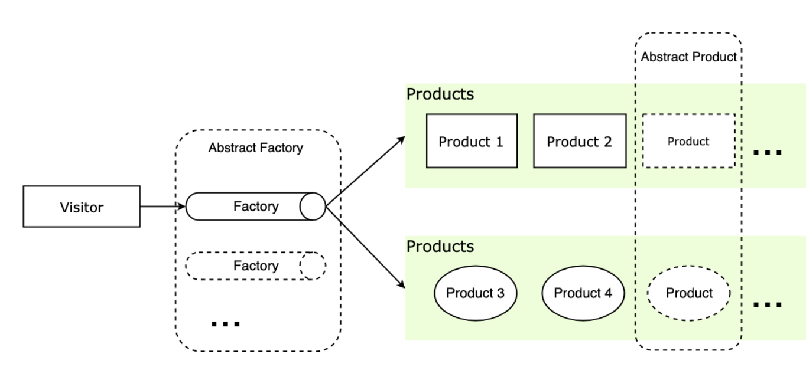
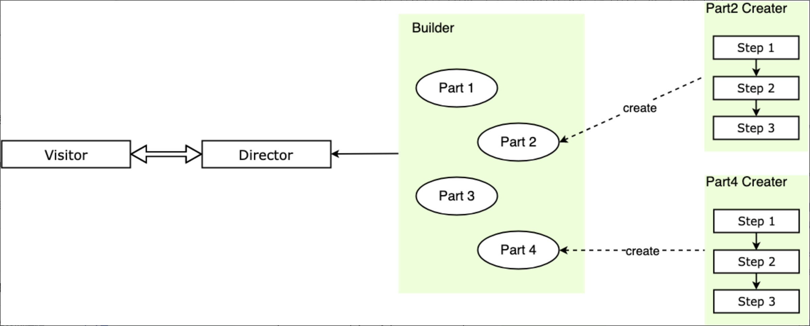

### 设计模式

#### 先序

- [柯里化](https://github.com/hongguang-alt/design-patterns/blob/master/perface/curry.js)
  - 参数复用
  - 提前计算
  - 延迟计算/运行
- [反柯里化](https://github.com/hongguang-alt/design-patterns/blob/master/perface/anti-curry.js)
- [偏函数](https://github.com/hongguang-alt/design-patterns/blob/master/perface/partial.js)

柯里化和反柯里化的区别：

1.柯里化是在运算前提前传参，可以传递多个参数。

2.反柯里化是延迟传参，在运算时就把已经固定的参数或者 this 上下文等作为参数延迟到未来传递。

偏函数和柯里化的区别：

1.柯里化是一个接受 n 个参数的函数，由原本的一次性传递所有参数并执行成为了可多次接受参数再执行

```javascript
    add = (x,y,x) => x + y + z -> currAdd = x=>y=>z=>x+y+z
```

2.偏函数固定了函数的某个部分，通过传入的参数或者额方法返回一个新的函数来接受剩余的参数，数量可能是一个也可能是多个。

当一个柯里化函数只接受两次参数时，比如 curry()()，这时候的柯里化函数和偏函数概念类似，可以认为偏函数是柯里化函数的退化版

<hr style="height:1px" />

#### 设计原则

JS 是一种基于原型链实现的模式。
这里着重将三大特性中的**继承**，以及六大原则中的**单一职责原则**，**开放封闭原则**，**最少知识原则**。

> 设计原则是指导思想，从思想上给我们指明程序设计的正确方向，是我们在开发设计过程中应该尽力遵守的准则。而设计模式是实现手段，因此设计模式也应该遵守这些原则，或者说，设计模式就是这些设计原则的一些具体体现。要达到的目标就是高内聚低耦合，高内聚是说模块内部要高度聚合，是模块内部的关系，低耦合是说模块与模块之间的耦合度要尽量低，是模块与模块间的关系。

- 单一职责原则（SRP）
  单一职责原则 （Single Responsibility Principle, SRP）是指对一个类（方法、对象，下文统称对象）来说，应该仅有一个引起它变化的原因。也就是说，一个对象只做一件事。
  - 优点：
    - 降低单个类（方法、对象）的复杂度，提高可读性和可维护性，功能之间的界限更清晰；
    - 类（方法、对象）之间根据功能被分为更小的粒度，有助于代码的复用；
  - 缺点：
    增加系统中类（方法、对象）的个数，实际上也增加了这些对象之间相互联系的难度，同时也引入了额外的复杂度。
- 开放封闭原则 (OCP) 开放封闭原则 （Open－Close Principle, OCP）是指一个模块在扩展性方面应该是开放的，而在更改性方面应该是封闭的，也就是对扩展开放，对修改封闭。
  - 优点： 增加可维护性，避免因为修改给系统带来的不稳定性。
- 最少知识原则 (LKP) 最少知识原则 （Least Knowledge Principle, LKP）又称为迪米特原则 （Law of Demeter, LOD），一个对象应该对其他对象有最少的了解。
  - 优点：降低类（方法、对象）之间不必要的依赖，减少耦合。
  - 缺点：类（方法、对象）之间不直接通信也会经过一个第三者来通信，那么就要权衡引入第三者带来的复杂度是否值得。
  <hr style="height:1px" />

#### 创建型模式

- [单例模式](https://github.com/hongguang-alt/design-patterns/blob/master/creat/singleton/singleton.js)

  > 单例模式 （Singleton Pattern）又称为单体模式，保证一个类只有一个实例，并提供一个访问它的全局访问点。也就是说，第二次使用同一个类创建新对象的时候，应该得到与第一次创建的对象完全相同的对象。

- [工厂模式](https://github.com/hongguang-alt/design-patterns/blob/master/creat/factory/factory.js)

  > 工厂模式 （Factory Pattern），根据不同的输入返回不同类的实例，一般用来创建同一类对象。工厂方式的主要思想是将对象的创建与对象的实现分离。

  > 抽象工厂模式 (Abstract Factory)，通过对类的工厂抽象使其业务对于产品类簇的创建，而不是负责创建某一类产品的实例。关键在于使用抽象类制定了实例的结构，调用者直接面向实例的结构编程，从实例的具体实现中解耦。

  

- [建造者模式](https://github.com/hongguang-alt/design-patterns/blob/master/creat/builder/builder.js)

  > 建造者模式（Builder Pattern）又称为生成器模式，分布构建一个复杂对象，并允许按步骤构造。同样的构建过程可以采用不同的表示，将一个复杂对象的构建层与其表示层分离。

  

  适用场景：

  - 相同的方法，不同的执行顺序，产生不一样的产品时，可以采用建造者模式。
  - 产品的组成部件类似，通过组装不同的组件获得不同产品时，可以采用建造者模式。

##### 注：

三大特性

- 封装
- 继承
- 多态

六大原则

- 单一职责原则
- 开放封闭原则
- 里式替换原则
- 依赖倒置原则
- 接口分离原则
- 最少知识原则
