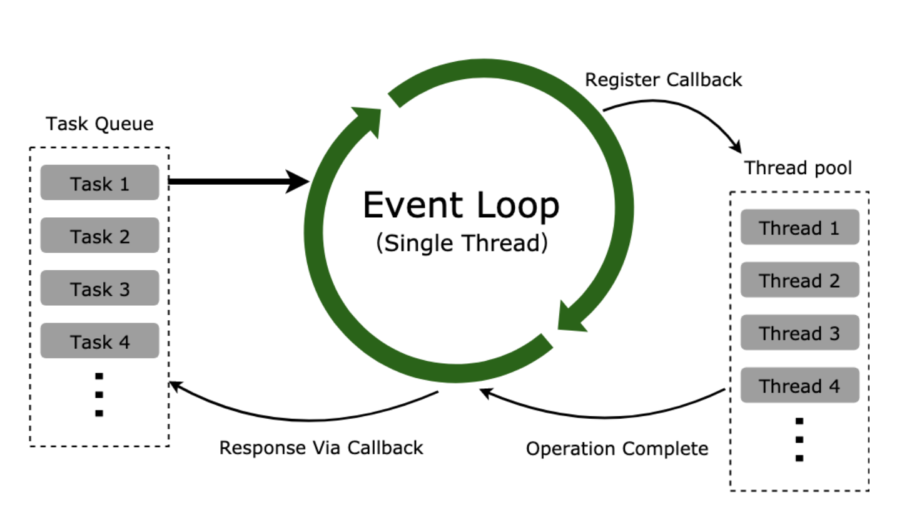
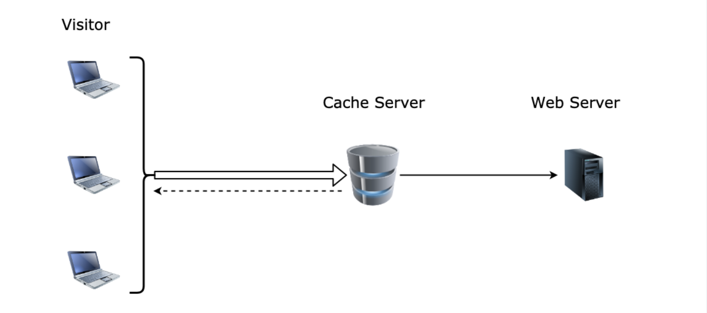

## 资源池

这种改进的模式一般叫做资源池（Resource Pool），或者叫对象池（Object Pool），可以当作是享元模式的升级版，实现不一样，但是目的相同。资源池一般维护一个装载对象的池子，封装有获取、释放资源的方法，当需要对象的时候直接从资源池中获取，使用完毕之后释放资源等待下次被获取。

资源池在后端应用相当广泛，比如缓冲池、连接池、线程池、字符常量池等场景，前端使用场景不多，但是也有使用，比如有些频繁的 DOM 创建销毁操作，就可以引入对象池来节约一些 DOM 创建损耗。

### 线程池

1.以 Node.js 中的线程池为例，Node.js 的 JavaScript 引擎是执行在单线程中的，启动的时候会新建 4 个线程放到线程池中，当遇到一些异步 I/O 操作（比如文件异步读写、DNS 查询等）或者一些 CPU 密集的操作（Crypto、Zlib 模块等）的时候，会在线程池中拿出一个线程去执行。如果有需要，线程池会按需创建新的线程。

> 1.所有任务都在主线程上执行，形成执行栈（Execution Context Stack）；

> 2.主线程之外维护一个任务队列（Task Queue），接到请求时将请求作为一个任务放入这个队列中，然后继续接收其他请求；

> 3.一旦执行栈中的任务执行完毕，主线程空闲时，主线程读取任务队列中的任务，检查队列中是否有要处理的事件，这时要分两种情况：如果是非 I/O 任务，就亲自处理，并通过回调函数返回到上层调用；如果是 I/O 任务，将传入的参数和回调函数封装成请求对象，并将这个请求对象推入线程池等待执行，主线程则读取下一个任务队列的任务，以此类推处理完任务队列中的任务；

> 4.线程池当线程可用时，取出请求对象执行 I/O 操作，任务完成以后归还线程，并把这个完成的事件放到任务队列的尾部，等待事件循环，当主线程再次循环到该事件时，就直接处理并返回给上层调用；

### 缓存

根据二八原则，80% 的请求其实访问的是 20% 的资源，我们可以将频繁访问的资源缓存起来，如果用户访问被缓存起来的资源就直接返回缓存的版本，这就是 Web 开发中经常遇到的缓存。

缓存服务器就是缓存的最常见应用之一，也是复用资源的一种常用手段。缓存服务器的示意图如下：

### 连接池

我们知道对数据库进行操作需要先创建一个数据库连接对象，然后通过创建好的数据库连接来对数据库进行 CRUD（增删改查）操作。如果访问量不大，对数据库的 CRUD 操作就不多，每次访问都创建连接并在使用完销毁连接就没什么，但是如果访问量比较多，并发的要求比较高时，频繁创建和销毁连接就比较消耗资源了。

### 字符常量池

很多语言的引擎为了减少字符串对象的重复创建，会在内存中维护有一个特殊的内存，这个内存就叫字符常量池。当创建新的字符串时，引擎会对这个字符串进行检查，与字符常量池中已有的字符串进行比对，如果存在有相同内容的字符串，就直接将引用返回，否则在字符常量池中创建新的字符常量，并返回引用。

类似于 Java、C# 这些语言，都有字符常量池的机制。JavaScript 有多个引擎，以 Chrome 的 V8 引擎为例，V8 在把 JavaScript 编译成字节码过程中就引入了字符常量池这个优化手段，这就是为什么很多 JavaScript 的书籍都提到了 JavaScript 中的字符串具有不可变性，因为如果内存中的字符串可变，一个引用操作改变了字符串的值，那么其他同样的字符串也会受到影响。

可以引用《JavaScript 高级程序设计》中的话解释一下：

> ECMAScript 中的字符串是不可变的，也就是说，字符串一旦创建，它们的值就不能改变。要改变某个变量保存的字符串，首先要销毁原来的字符串，然后再用另一个包含新值的字符串填充该变量。
